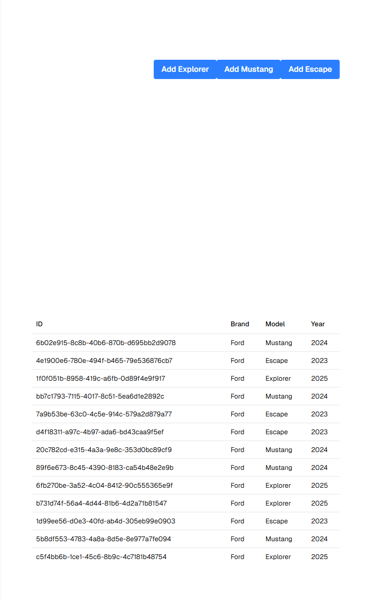

# 🚗 Best Practices & Design Patterns Workshop

> Una refactorización técnica aplicando principios SOLID y Patrones de Diseño (GoF) para resolver problemas de escalabilidad y deuda técnica en un sistema de gestión vehicular.

---

## Descripción del Escenario

El proyecto simula un entorno empresarial real ("Codificando Con Patrones Cía. Ltda.") donde se heredó un sistema legacy con varias limitaciones críticas:

* **Falta de Base de Datos:** El esquema de BD no estaba listo, rompiendo el repositorio original.
* **Complejidad Creciente:** Necesidad de soportar nuevas propiedades dinámicas sin crear constructores telescópicos.
* **Escalabilidad:** Requerimiento de añadir nuevos modelos (Mustang, Explorer, Escape) sin violar el principio *Open/Closed*.

**Objetivo:** Refactorizar la aplicación para permitir persistencia en memoria, creación flexible de objetos y desacoplamiento de clases.

---

## 🏗 Arquitectura y Patrones

Para solucionar los problemas identificados, se implementaron los siguientes patrones de diseño creacionales:

### 1. Factory Method (Creación Desacoplada)
**Problema:** El controlador tenía la lógica de creación "hardcodeada", dificultando agregar nuevos modelos como el "Ford Escape".
**Solución:** Se implementó una fábrica abstracta que delega la creación a subclases específicas.

### 2. Builder Pattern (Construcción de Objetos Complejos)
**Problema:** Se requerían nuevas propiedades (`Year`, y futuras 20 propiedades) lo que generaría constructores gigantes y difíciles de mantener.
**Solución:** `CarModelBuilder` permite la construcción paso a paso del vehículo, separando la construcción de su representación.

### 3. Singleton Pattern (Persistencia In-Memory)
**Problema:** Sin base de datos real, los datos se perdían en cada petición HTTP.
**Solución:** Se creó un `MemoryCollection` estático envuelto en un repositorio, garantizando una única instancia de almacenamiento durante el ciclo de vida de la app.

---

## 🚀 Demo de la Aplicación

---

## 💻 Tecnologías

* **Framework:** .NET Core / ASP.NET MVC
* **Lenguaje:** C#
* **Frontend:** Razor Views, HTML5, Bootstrap
* **Herramientas:** Visual Studio 2022, Git

---

##  Autor

**Sebastián Almeida**
* **Materia:** Ingeniería Web - Universidad de las Américas (UDLA)
* **Fecha:** 14 de Diciembre, 2025

---